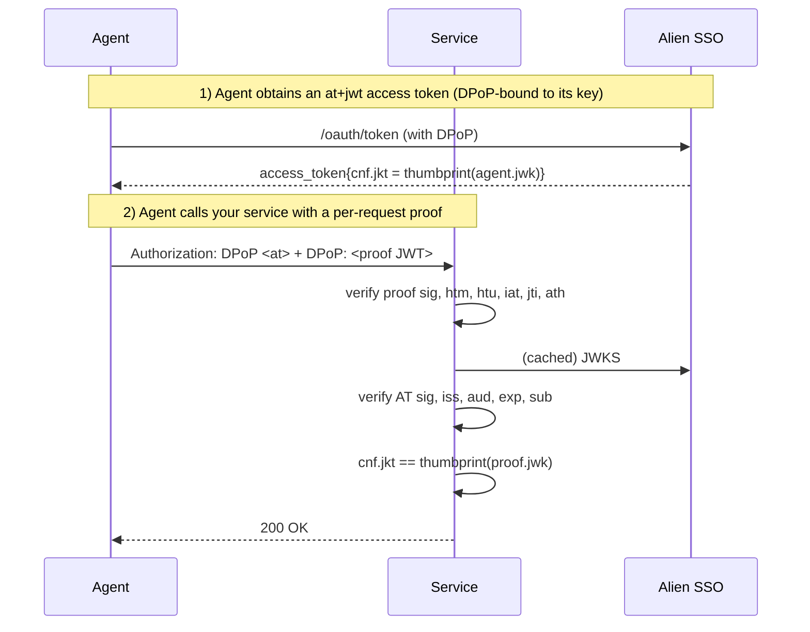

# @alien-id/sso-agent-id

> Verify inbound RFC 9449 (OAuth 2.0 DPoP) requests from Alien-bound agents in
> any Node.js service. Zero runtime dependencies.

The Alien agent sends two HTTP headers to your service:

```
Authorization: DPoP <access_token>      ← Alien at+jwt, signed by SSO
DPoP:          <proof JWT>              ← EdDSA, signed by the agent's own key
```

This library walks the [RFC 9449 §4.3](https://www.rfc-editor.org/rfc/rfc9449#section-4.3)
verification checklist, the [RFC 7800 §3.1](https://www.rfc-editor.org/rfc/rfc7800#section-3.1)
/ [RFC 9449 §6.1](https://www.rfc-editor.org/rfc/rfc9449#section-6.1) `cnf.jkt`
proof-of-possession binding, and the [RFC 9068 §4](https://www.rfc-editor.org/rfc/rfc9068#section-4)
access-token claim checks. On success, you can trust the `sub` (the human
owner) and `jkt` (the agent's DPoP key thumbprint) — both transitively signed
by the SSO and the agent respectively.

## Install

```bash
npm install @alien-id/sso-agent-id
```

Requires Node.js 18+ (uses built-in `crypto`, `URL`).

## Quick start

```typescript
import { fetchAlienJWKS, verifyDPoPRequest } from '@alien-id/sso-agent-id';

// Fetch the SSO's JWKS once at startup. Cache it; refresh every few hours.
const jwks = await fetchAlienJWKS();

// In your request handler:
const result = verifyDPoPRequest(req, { jwks });

if (!result.ok) {
  return res.status(401)
    .set('WWW-Authenticate', `DPoP error="${result.code}"`)
    .json({ error: result.error });
}

// result.sub  — human owner's AlienID address (signed by SSO)
// result.jkt  — agent's Ed25519 key thumbprint (RFC 7638)
// result.accessTokenClaims, result.proofClaims — raw decoded JWT payloads
```

That's the full integration for a service that wants to accept any agent on
the Alien network. `expectedIssuer` defaults to `https://sso.alien-api.com`
and `expectedAudience` defaults to that same value — see
[Federated audience](#federated-audience) for the rationale and when to
override.

The verifier needs the *full* request: method, URL, and headers. It uses these
to compare the proof's `htm` and `htu` claims against the actual request
(RFC 9449 §4.3 step 8–9).

## Federated audience

The Alien SSO mints every access token with `aud = [client_id, issuer]`. By
default the verifier checks that `aud` contains `expectedIssuer` — i.e. the
token was minted by the Alien SSO at all. This is the "federated audience"
pattern: every Alien-aware service treats the SSO issuer URL as its own
audience identifier, so one agent identity works against the whole network
with no per-service configuration.

The default also defends against id_token confusion: an `id+jwt` from the
same SSO has `aud = client_id` only (no issuer), so it can't impersonate an
access token.

Override `expectedAudience` only when you specifically want to *narrow*
acceptance:

```typescript
// Scope to agents bound to your own OAuth client only:
verifyDPoPRequest(req, { jwks, expectedAudience: 'YOUR_CLIENT_ID' });

// Scope to an RFC 8707 resource indicator (when SSO/agent support lands):
verifyDPoPRequest(req, { jwks, expectedAudience: 'https://your.service/api' });

// Skip the audience check entirely (test fixtures only):
verifyDPoPRequest(req, { jwks, expectedAudience: false });
```

See [`docs/RS-INTEGRATION.md`](./docs/RS-INTEGRATION.md) for the full
resource-server integration checklist.

## API

### `verifyDPoPRequest(req, opts)`

| Parameter | Type | Description |
| --- | --- | --- |
| `req.method` | `string` | HTTP method, e.g. `"GET"`. Must match the proof's `htm` (case-sensitive). |
| `req.url` | `string` | Full request URL including scheme/host/path. Compared to the proof's `htu` after both sides strip query and fragment. |
| `req.headers` | `Record<string, string \| string[] \| undefined>` | Must include exactly one `authorization: DPoP <at>` and exactly one `dpop: <proof>`. |
| `opts.jwks` | `JWKS` | Pre-fetched JWKS from the SSO (see `fetchAlienJWKS`). |
| `opts.expectedIssuer` | `string` | Defaults to `https://sso.alien-api.com`. Override for staging/self-hosted SSO. |
| `opts.expectedAudience` | `string \| false` | Defaults to `expectedIssuer` (federated audience). Pass a string to scope to a specific OAuth client_id or RFC 8707 resource. Pass `false` to skip (test fixtures only). |
| `opts.proofMaxAgeSec` | `number` | DPoP proof freshness window. Default `30`. |
| `opts.clockSkewSec` | `number` | Clock skew applied to access-token `exp`. Default `30`. |
| `opts.jtiStore` | `DPoPJtiStore` | Replay-protection store for the proof's `jti` claim. Default: in-memory `Map`. Inject a shared store (e.g. Redis-backed) for multi-instance deployments. |

**Returns `VerifyDPoPSuccess`:**

```typescript
{
  ok: true,
  sub: string,                          // owner sub (from at+jwt)
  jkt: string,                          // RFC 7638 thumbprint of the agent's DPoP key
  accessTokenClaims: Record<string, unknown>,
  proofClaims: Record<string, unknown>,
}
```

**Returns `VerifyDPoPFailure`:**

```typescript
{
  ok: false,
  code: string,    // machine-readable, e.g. "jkt_mismatch"
  error: string,   // human-readable
}
```

### `fetchAlienJWKS(ssoBaseUrl?)`

Fetch the JWKS from the Alien SSO server. Callers should cache the result.

| Parameter | Type | Description |
| --- | --- | --- |
| `ssoBaseUrl` | `string` | Default: `https://sso.alien-api.com`. |

Returns `Promise<JWKS>`.

### `DPoPJtiStore`

Pluggable interface for proof-replay protection (RFC 9449 §11.1):

```typescript
interface DPoPJtiStore {
  has(jti: string): boolean;
  add(jti: string, iat: number): void;
}
```

The default in-memory store is single-process and capped at 10,000 entries.
For multi-instance deployments, back it with Redis/Memcached so a captured
proof can't be replayed against a different worker.

## Framework examples

### Express

```typescript
import express from 'express';
import { fetchAlienJWKS, verifyDPoPRequest } from '@alien-id/sso-agent-id';

const app = express();
const jwks = await fetchAlienJWKS();

function requireAgent(req, res, next) {
  // Express's req.url is the path; reconstruct the absolute URL the agent saw.
  const fullUrl = `${req.protocol}://${req.get('host')}${req.originalUrl}`;
  const result = verifyDPoPRequest(
    { method: req.method, url: fullUrl, headers: req.headers },
    { jwks },
  );
  if (!result.ok) {
    res.set('WWW-Authenticate', `DPoP error="${result.code}"`);
    return res.status(401).json({ error: result.error });
  }
  req.agent = { sub: result.sub, jkt: result.jkt };
  next();
}

app.get('/api/data', requireAgent, (req, res) => {
  res.json({ data: 'secret', owner: req.agent.sub });
});
```

If you sit behind a reverse proxy (ALB, Cloudflare, nginx), trust
`X-Forwarded-Proto` and `X-Forwarded-Host` to reconstruct the URL the agent
actually addressed — otherwise `htu` comparison will fail.

### Fastify

```typescript
import Fastify from 'fastify';
import { fetchAlienJWKS, verifyDPoPRequest } from '@alien-id/sso-agent-id';

const app = Fastify();
const jwks = await fetchAlienJWKS();

app.addHook('preHandler', async (request, reply) => {
  const fullUrl = `${request.protocol}://${request.hostname}${request.url}`;
  const result = verifyDPoPRequest(
    { method: request.method, url: fullUrl, headers: request.headers },
    { jwks },
  );
  if (!result.ok) {
    reply.header('WWW-Authenticate', `DPoP error="${result.code}"`);
    return reply.code(401).send({ error: result.error });
  }
  request.agent = { sub: result.sub, jkt: result.jkt };
});
```

### Next.js (App Router)

```typescript
import { NextRequest, NextResponse } from 'next/server';
import { fetchAlienJWKS, verifyDPoPRequest } from '@alien-id/sso-agent-id';

const jwks = await fetchAlienJWKS();

export async function GET(req: NextRequest) {
  // NextRequest's headers are a Headers instance — flatten for the verifier.
  const headers: Record<string, string | undefined> = {};
  req.headers.forEach((v, k) => { headers[k] = v; });

  const result = verifyDPoPRequest(
    { method: req.method, url: req.url, headers },
    { jwks },
  );
  if (!result.ok) {
    return NextResponse.json({ error: result.error }, {
      status: 401,
      headers: { 'WWW-Authenticate': `DPoP error="${result.code}"` },
    });
  }
  return NextResponse.json({ owner: result.sub, agent_jkt: result.jkt });
}
```

## Access control patterns

### Any owner-bound agent

```typescript
if (!result.ok) return res.status(401).json({ error: result.error });
// result.sub is guaranteed by the SSO's signature.
```

### Allow-list by agent key

```typescript
const ALLOWED_JKTS = new Set(['wEf6o2ux8sBAUG4oQYhP284gfpZwUJMTxXDPH5XxthY', ...]);
if (!ALLOWED_JKTS.has(result.jkt)) {
  return res.status(403).json({ error: 'Agent not authorized' });
}
```

### Allow-list by owner

```typescript
const ALLOWED_OWNERS = new Set(['00000003...', '00000003...']);
if (!ALLOWED_OWNERS.has(result.sub)) {
  return res.status(403).json({ error: 'Owner not authorized' });
}
```

## How it works



Every fact the service trusts is signed either by the SSO (over standard
RFC 9068 access-token claims) or by the agent (over the per-request RFC 9449
DPoP proof). There is no parallel envelope: no `ownerBinding`, no
`idTokenHash`, no agent-issued attestation of `sub`. The cnf-binding ties the
SSO-attested owner to the per-request proof-of-possession.

## Error codes

`result.code` values map to RFC 9449 / RFC 9068 / RFC 6750 categories. Stable
across releases; new values may be added.

| Code | RFC | Meaning |
| --- | --- | --- |
| `missing_authorization` | RFC 9449 §4.3 step 1 | Missing or duplicate `Authorization` header |
| `invalid_scheme` | RFC 9449 §7.1 | Not `Authorization: DPoP <token>` |
| `missing_dpop` | RFC 9449 §4.3 step 1 | Missing or duplicate `DPoP` header |
| `malformed_proof` | §4.3 step 2 | DPoP value is not a well-formed JWS |
| `bad_proof_typ` | §4.3 step 4 | `typ` ≠ `dpop+jwt` |
| `bad_proof_alg` | §4.3 step 5 | `alg` ≠ `EdDSA` (Alien agent keys are Ed25519) |
| `missing_proof_jwk` / `bad_proof_jwk` | §4.3 step 6 | Header `jwk` missing or not OKP/Ed25519 |
| `private_in_proof_jwk` | §4.3 step 6 | Proof leaks the private `d` member |
| `bad_proof_signature` | §4.3 step 7 | Signature does not verify with the embedded `jwk` |
| `bad_proof_htm` | §4.3 step 8 | `htm` ≠ request method |
| `bad_proof_htu` | §4.3 step 9 | `htu` ≠ request URL (query/fragment stripped) |
| `bad_proof_iat` / `stale_proof` / `future_proof` | §4.3 step 11 | Proof `iat` is malformed or outside the freshness window |
| `missing_proof_jti` / `replayed_proof_jti` | §4.3 step 12 + §11.1 | Proof lacks `jti` or it's been seen before |
| `bad_proof_ath` | §4.3 step 10 | `ath` ≠ SHA-256(access_token) |
| `malformed_access_token` | RFC 9068 §4 | Access-token is not a well-formed JWS |
| `bad_access_token_typ` | RFC 9068 §4 | Access-token `typ` ≠ `at+jwt` |
| `bad_access_token_alg` | RFC 9068 §4 | Access-token `alg` ≠ `RS256` |
| `unknown_access_token_kid` | RFC 7515 | Access-token's `kid` not in the JWKS |
| `bad_access_token_signature` / `access_token_sig_error` | RFC 7515 | Access-token signature fails verification |
| `bad_access_token_iss` | RFC 7519 §4.1.1 | `iss` ≠ `expectedIssuer` |
| `bad_access_token_aud` | RFC 7519 §4.1.3 | `aud` does not include `expectedAudience` (defaults to `expectedIssuer`) |
| `expired_access_token` | RFC 7519 §4.1.4 | Access-token `exp` is in the past |
| `missing_access_token_sub` | RFC 7519 §4.1.2 | Access-token has no `sub` claim |
| `missing_cnf_jkt` | RFC 7800 §3.1 | Access-token has no `cnf.jkt` (not DPoP-bound) |
| `jkt_mismatch` | RFC 9449 §6.1 | `cnf.jkt` ≠ thumbprint of the proof's `jwk` |

## Caveats

- **Pre-fetched JWKS.** `fetchAlienJWKS()` does not cache. Call it at startup,
  hold the result, refresh every few hours. The SSO rotates signing keys
  infrequently.
- **Reverse proxies.** If your service runs behind a load balancer or CDN,
  reconstruct the URL the agent actually addressed (using
  `X-Forwarded-Proto` / `X-Forwarded-Host`) — otherwise the `htu` comparison
  will reject every request.
- **jti replay store.** The default in-memory store is single-process. Inject
  a shared `jtiStore` for multi-instance deployments so a captured proof can't
  be replayed against a different worker.
- **Clock sync.** The 30-second default freshness window assumes loosely
  synchronized clocks. Tighten via `proofMaxAgeSec` / `clockSkewSec` if you
  have stricter NTP, widen if you have flakier clocks.

## Additional resources

- [Alien Agent ID docs](https://docs.alien.org/agent-id-guide/introduction)
- [RFC 9449 — OAuth 2.0 Demonstrating Proof of Possession (DPoP)](https://www.rfc-editor.org/rfc/rfc9449)
- [RFC 9068 — JWT Profile for OAuth 2.0 Access Tokens](https://www.rfc-editor.org/rfc/rfc9068)
- [RFC 7800 — Proof-of-Possession Key Semantics for JWTs](https://www.rfc-editor.org/rfc/rfc7800)
