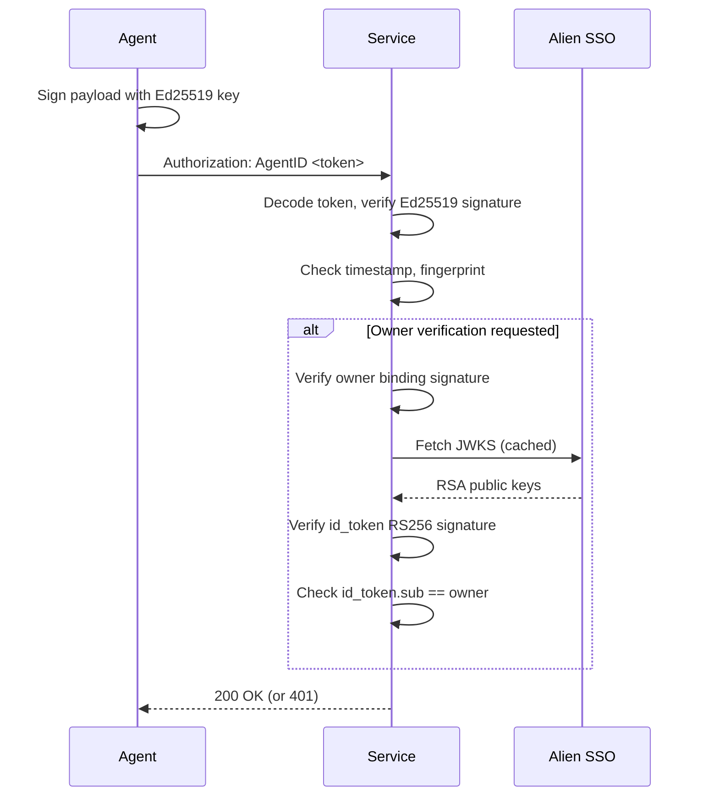

# @alien-id/sso-agent-id

> Verify Alien Agent ID tokens in Node.js services. Zero dependencies, Ed25519 signature
> verification, full owner chain verification via Alien SSO.

---

## Additional Resources

- [Alien Agent ID docs](https://docs.alien.org/agent-id-guide/introduction)
- [Example Next.js app](https://github.com/alien-id/sso-sdk-js/tree/main/apps/example-sso-agent-id-app/README.md) — working guestbook demo. Live demo [here](https://agent-sso.alien.org)

---

## Table of Contents

- [Install](#install)
- [Quick start](#quick-start)
- [Basic verification](#basic-verification)
- [API](#api)
- [How it works](#how-it-works)
- [Security model](#security-model)
- [Framework examples](#framework-examples)
- [Access control patterns](#access-control-patterns)
- [Configuration](#configuration)
- [Error reference](#error-reference)

---

## Install

```bash
npm install @alien-id/sso-agent-id
```

Requires Node.js 18+ (Ed25519 support in `node:crypto`). Zero runtime dependencies.

## Quick start

Verify an agent's identity **and** that their claimed owner is real:

```typescript
import {
  fetchAlienJWKS,
  verifyAgentRequestWithOwner,
} from '@alien-id/sso-agent-id';

// Fetch JWKS at startup and cache it
const jwks = await fetchAlienJWKS();

// In your request handler
const result = verifyAgentRequestWithOwner(req, {
  jwks,
  expectedAudience: process.env.ALIEN_PROVIDER_ADDRESS!, // your OAuth client_id
});
if (!result.ok) {
  return res.status(401).json({ error: result.error });
}

// result.fingerprint  — stable agent identity
// result.owner        — human owner's AlienID address
// result.ownerVerified — true: cryptographically proven via Alien SSO
// result.issuer       — "https://sso.alien-api.com"
```

This verifies the full trust chain: agent key → owner binding → id_token
→ Alien SSO JWKS → verified human. The `owner` field is not just
self-asserted — it's backed by the SSO server's RS256 signature and
the id_token's `cnf.jkt` claim binds the entire chain to *this* agent's
keypair (RFC 7800 §3.1 / RFC 9449 §6.1), so a stolen id_token cannot
be replayed by a different agent.

## Basic verification

If you only need to confirm the agent holds a valid Ed25519 key and
don't care about the owner claim, you can use `verifyAgentToken`.

> **Warning:** The `owner` field is **not verified** in this mode.
> Any process can generate a keypair and claim any owner address.
> Do not use `result.owner` for access control decisions without
> full owner verification above.

```typescript
import { verifyAgentRequest } from '@alien-id/sso-agent-id';

const result = verifyAgentRequest(req);
if (!result.ok) {
  return res.status(401).json({ error: result.error });
}

// result.ownerVerified === false
```

## API

### `verifyAgentToken(tokenB64, opts?)`

Verify a base64url-encoded Agent ID token.

| Parameter | Type | Description |
| --- | --- | --- |
| `tokenB64` | `string` | The token (everything after `"AgentID "` in the header) |
| `opts.maxAgeMs` | `number` | Max token age. Default: `300000` (5 min) |
| `opts.clockSkewMs` | `number` | Allowed clock skew for future timestamps. Default: `30000` (30 sec) |

**Returns `VerifySuccess`:**

```typescript
{
  ok: true,
  fingerprint: string,     // SHA-256 hex of public key DER (stable identity)
  publicKeyPem: string,    // Ed25519 public key in SPKI PEM
  owner: string | null,    // Human owner's AlienID address
  ownerVerified: false,    // Not verified — use verifyAgentTokenWithOwner
  timestamp: number,       // Token creation time (ms)
  nonce: string,           // Random hex (replay protection)
}
```

**Returns `VerifyFailure`:**

```typescript
{
  ok: false,
  error: string,  // Human-readable error
}
```

### `verifyAgentRequest(req, opts?)`

Extract the token from `req.headers.authorization` and verify it.
Works with Express, Fastify, Node `http`, Next.js, or any object with a
`headers` property.

| Parameter | Type | Description |
| --- | --- | --- |
| `req` | `{ headers: Record<string, string \| string[] \| undefined> }` | Request object |
| `opts` | `VerifyOptions` | Same options as `verifyAgentToken` |

### `verifyAgentTokenWithOwner(tokenB64, opts)`

Verify a token with full owner chain verification.

| Parameter | Type | Description |
| --- | --- | --- |
| `tokenB64` | `string` | The token |
| `opts.jwks` | `JWKS` | Pre-fetched JWKS from `fetchAlienJWKS()` |
| `opts.expectedAudience` | `string` | **Required.** Your OAuth `client_id` (provider address). The id_token's `aud` claim must contain this value (OIDC §3.1.3.7.3). |
| `opts.expectedIssuer` | `string` | Expected `iss` value. Default: `https://sso.alien-api.com`. Override only for staging or self-hosted SSO. |
| `opts.expectedNonce` | `string` | Required iff the authorization request sent a `nonce`. The id_token's `nonce` claim must equal this byte-for-byte (OIDC §3.1.3.7 step 11). |
| `opts.trustedAudiences` | `readonly string[]` | Additional `aud` values to trust when verifying federated / multi-audience tokens (OIDC §3.1.3.7 step 3). Default: `[expectedAudience]`. |
| `opts.maxAgeMs` | `number` | Max agent-envelope age. Default: `300000` (5 min) |
| `opts.clockSkewMs` | `number` | Allowed clock skew. Default: `30000` (30 sec) |

**Returns `VerifyOwnerSuccess`:**

```typescript
{
  ok: true,
  fingerprint: string,
  publicKeyPem: string,
  owner: string,
  ownerVerified: true,          // Owner cryptographically verified
  issuer: string,               // SSO issuer URL
  timestamp: number,
  nonce: string,
}
```

### `verifyAgentRequestWithOwner(req, opts)`

Extract the token from `req.headers.authorization` and verify with
full owner chain.

| Parameter | Type | Description |
| --- | --- | --- |
| `req` | `{ headers: Record<string, string \| string[] \| undefined> }` | Request object |
| `opts` | `VerifyOwnerOptions` | Same options as `verifyAgentTokenWithOwner` |

### `fetchAlienJWKS(ssoBaseUrl?)`

Fetch the JWKS from the Alien SSO server. Callers should cache the result.

| Parameter | Type | Description |
| --- | --- | --- |
| `ssoBaseUrl` | `string` | Default: `https://sso.alien-api.com` |

Returns `Promise<JWKS>`.

## How it works



The token is **self-contained**: it carries the agent's public key and
the full owner verification chain, so verification requires no database lookup,
no key exchange, and no pre-registration.

## Security model

`verifyAgentTokenWithOwner` is the boundary between "anyone can post bytes"
and "this request is from a real agent acting for a real human". The chain
anchors on the SSO's JWKS (fetched from `/oauth/jwks`, listed in
`/.well-known/openid-configuration` per OIDC Discovery / RFC 8414) and is
walked in this order:

| # | What is checked | Spec |
|---|---|---|
| 1 | Outer envelope is canonical base64url; required fields present; `fingerprint` matches SHA-256 of `publicKeyPem` | RFC 4648 §5 |
| 2 | Agent's Ed25519 signature over the canonical envelope is valid | — |
| 3 | Envelope timestamp within `maxAgeMs` (default 5 min), allowing `clockSkewMs` (default 30 s) | — |
| 4 | `ownerBinding.payloadHash` equals SHA-256 of the canonical binding payload | — |
| 5 | Binding signature is valid Ed25519 under the **same** agent key | — |
| 6 | Binding's `agentInstance.publicKeyFingerprint` and `ownerSessionSub` match the envelope (cross-checks) | — |
| 7 | `ownerBinding.idTokenHash` equals SHA-256 of the embedded id_token | — |
| 8 | id_token header: `alg=RS256`, `typ` is absent or `JWT` (case-insensitive); any `crit` parameter is rejected | RFC 7515 §4.1.11, RFC 8725 §3.7 |
| 9 | id_token RS256 signature verifies under a JWKS key whose `kid`, `kty=RSA`, `use=sig` (or absent), and pinned `alg` (or absent) match | RFC 7515 §10.7 |
| 10 | `iss == expectedIssuer`; `aud` contains `expectedAudience`; every `aud` entry is in the trust set; `azp` rules enforced for multi-audience tokens | OIDC §3.1.3.7.3 / .7.6 / .7.7 |
| 11 | `sub` equals the envelope's claimed owner | — |
| 12 | `exp` is in the future; `nbf` (if present) has passed; `iat` (if present) is numeric | RFC 7519 §4.1.4-6 |
| 13 | `nonce` equals `expectedNonce` when supplied | OIDC §3.1.3.7 step 11 |
| 14 | id_token's `cnf.jkt` equals the RFC 7638 thumbprint of the agent's Ed25519 public key — **the chain is bound to *this* keypair** | RFC 7800 §3.1 / RFC 9449 §6.1 |

### Forgery attempts that fail closed

- **Stolen id_token + attacker's own keypair** → step 14 (`cnf.jkt does not bind to agent key`)
- **Stolen id_token replayed by a different agent** → step 14
- **Envelope signed by a key the SSO never approved** → no binding presence (step 4) or `agentInstance` mismatch (step 6)
- **Tampered envelope, binding, or id_token** → signature step (2, 5, or 9)
- **`alg: none` or unsupported alg in id_token** → step 8
- **Cross-JWT confusion (`typ=at+jwt`)** → step 8
- **Token reuse beyond freshness window** → step 3 or step 12
- **Audience confusion (token issued for a different RP)** → step 10
- **Replay of a `nonce`-bound token to a different session** → step 13

74 unit tests in `tests/` pin every step. Run `npm test` to verify.

### What this is *not*

- **Not RFC 9449 DPoP-per-request verification.** A fresh DPoP proof JWT
  (with `htm`/`htu`/`iat`/`jti`) is verified by the **SSO** once at
  `/oauth/token`, when the id_token is minted. Each subsequent request to
  your service carries proof-of-possession via the agent envelope's
  Ed25519 signature, anchored to the issuer's `cnf.jkt` claim. Same
  sender-constraint security property; different transport. You do not
  need a `jti` replay cache.
- **Not JWKS caching.** `fetchAlienJWKS()` is a one-shot fetcher. Call it
  at startup, cache the result, and refresh periodically (every few
  hours is typical; the SSO publishes new keys infrequently).

## Framework examples

### Next.js App Router

```typescript
import { NextRequest, NextResponse } from 'next/server';
import { verifyAgentToken } from '@alien-id/sso-agent-id';

export async function GET(req: NextRequest) {
  const auth = req.headers.get('authorization');
  if (!auth?.startsWith('AgentID ')) {
    return NextResponse.json({ error: 'Unauthorized' }, { status: 401 });
  }

  const result = verifyAgentToken(auth.slice(8).trim());
  if (!result.ok) {
    return NextResponse.json({ error: result.error }, { status: 401 });
  }

  return NextResponse.json({ agent: result.fingerprint });
}
```

### Express

```typescript
import express from 'express';
import { verifyAgentRequest } from '@alien-id/sso-agent-id';

const app = express();

function requireAgent(req, res, next) {
  const result = verifyAgentRequest(req);
  if (!result.ok) return res.status(401).json({ error: result.error });
  req.agent = result;
  next();
}

app.get('/api/data', requireAgent, (req, res) => {
  res.json({ data: 'secret', agent: req.agent.fingerprint });
});
```

### Fastify

```typescript
import Fastify from 'fastify';
import { verifyAgentRequest } from '@alien-id/sso-agent-id';

const app = Fastify();

app.decorateRequest('agent', null);

app.addHook('preHandler', async (request, reply) => {
  if (!request.headers.authorization?.startsWith('AgentID ')) return;
  const result = verifyAgentRequest(request);
  if (!result.ok) return reply.code(401).send({ error: result.error });
  request.agent = result;
});
```

## Access control patterns

### Any verified agent

```typescript
if (!result.ok) return res.status(401).json({ error: result.error });
```

### Human-owned agents only

```typescript
if (!result.owner) return res.status(403).json({ error: 'Human-owned agent required' });
```

### Allow-list by fingerprint

```typescript
const ALLOWED = new Set(['f5d9fac4...', '42fbde2a...']);
if (!ALLOWED.has(result.fingerprint)) {
  return res.status(403).json({ error: 'Agent not authorized' });
}
```

### Allow-list by verified owner

Use `verifyAgentRequestWithOwner` to ensure the owner claim is real:

```typescript
import {
  fetchAlienJWKS,
  verifyAgentRequestWithOwner,
} from '@alien-id/sso-agent-id';

const jwks = await fetchAlienJWKS();
const OWNERS = new Set(['00000003...', '00000003...']);

const result = verifyAgentRequestWithOwner(req, {
  jwks,
  expectedAudience: process.env.ALIEN_PROVIDER_ADDRESS!,
});
if (!result.ok) return res.status(401).json({ error: result.error });
if (!OWNERS.has(result.owner)) {
  return res.status(403).json({ error: 'Owner not authorized' });
}
```

## Configuration

| Option | Default | Description |
| --- | --- | --- |
| `maxAgeMs` | `300000` (5 min) | Reject tokens older than this |
| `clockSkewMs` | `30000` (30 sec) | Allow tokens this far in the future |

```typescript
verifyAgentToken(token, {
  maxAgeMs: 60_000,      // 1 minute
  clockSkewMs: 10_000,   // 10 seconds
});
```

## Error reference

| Error | Meaning |
| --- | --- |
| `Invalid token encoding` | Not valid base64url JSON |
| `Unsupported token version: N` | Unknown token version |
| `Token expired (age: Ns)` | Older than `maxAgeMs` or future beyond `clockSkewMs` |
| `Invalid public key in token` | `publicKeyPem` is not a valid Ed25519 key |
| `Fingerprint does not match public key` | `fingerprint` doesn't match SHA-256 of the key DER |
| `Signature verification failed` | Ed25519 signature is invalid — token was tampered with |
| `Multiple Authorization headers` | Duplicate Authorization headers detected |
| `Missing header: Authorization: AgentID <token>` | No valid header found |
| `Missing field: ownerBinding` | Token lacks owner binding (for owner verification) |
| `Missing field: idToken` | Token lacks id_token (for owner verification) |
| `Owner binding signature verification failed` | Binding not signed by this agent key |
| `Owner binding agent fingerprint mismatch` | Binding references a different agent |
| `Owner binding ownerSessionSub mismatch` | Binding owner differs from token owner |
| `id_token hash does not match owner binding` | id_token doesn't match the binding |
| `id_token signature verification failed` | RS256 signature invalid against JWKS |
| `id_token sub does not match token owner` | JWT subject differs from claimed owner |

---
